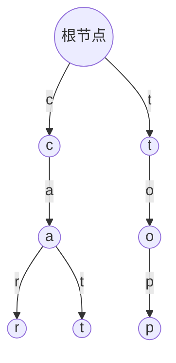
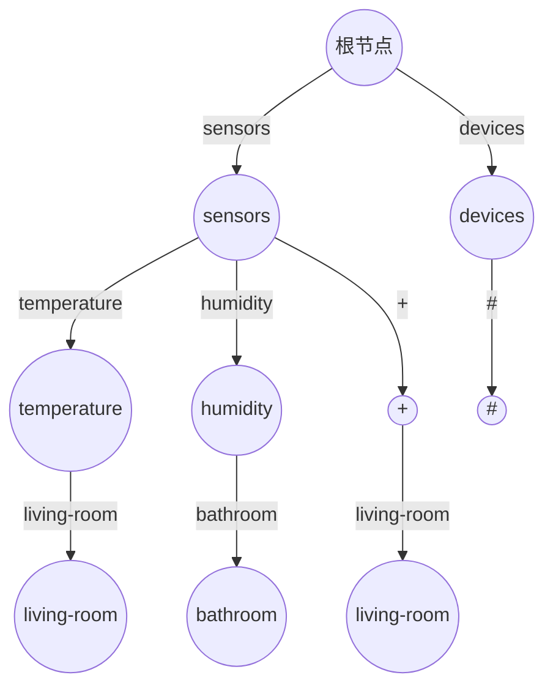
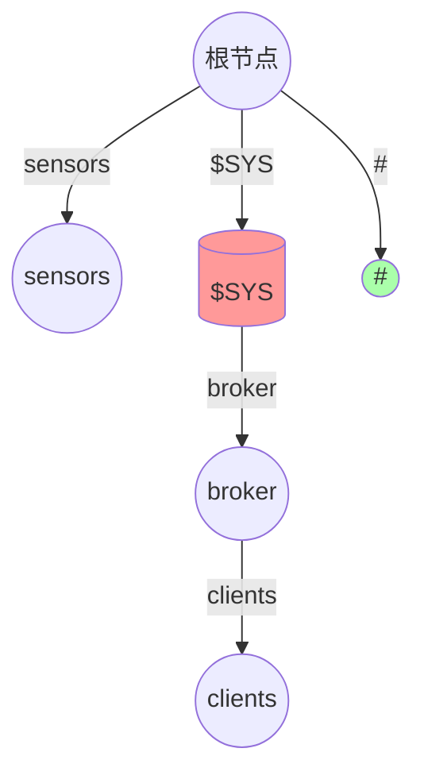
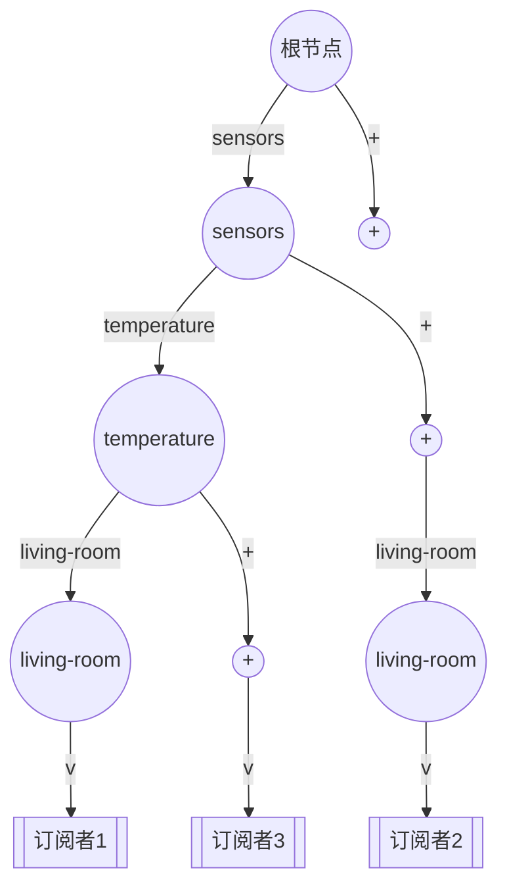
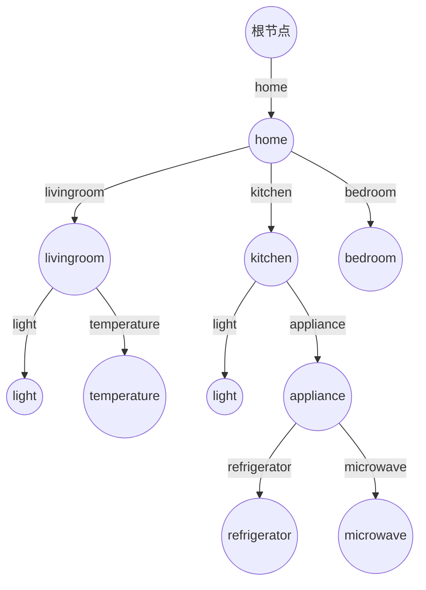
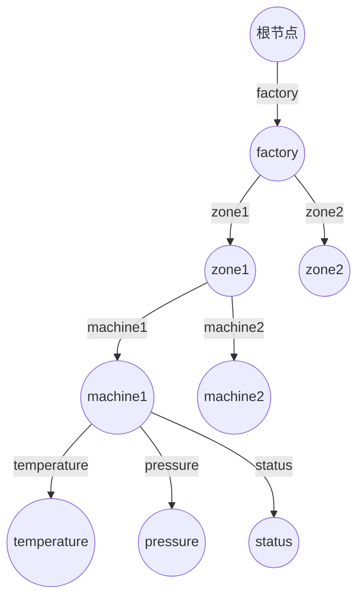

前缀树（Trie）是一种强大的数据结构，特别适合于字符串查找和前缀匹配。在 MQTT 这样的消息协议中，前缀树可以高效地支持主题匹配。本文将深入探讨前缀树的原理及其在 MQTT 主题匹配中的应用。

## 什么是前缀树？

前缀树，又称字典树或 Trie 树，是一种树形数据结构，用于保存关联数组，其中的键通常是字符串。与二叉树不同，前缀树的节点在边上存储字符，而不是在节点中。



上图展示了一个存储了 "car"、"cat"、"top" 这三个单词的前缀树。

## MQTT 主题结构

MQTT 主题是以斜杠（`/`）分隔的层次结构字符串，例如：

- `sensors/temperature/living-room`
- `sensors/humidity/bathroom`
- `devices/lights/kitchen`

这种层次结构天然适合用前缀树来表示和匹配。

## MQTT 主题匹配特性

MQTT 支持两种通配符：

- `+`：单层通配符，匹配一个主题层级
- `#`：多层通配符，匹配多个主题层级（必须放在主题末尾）

例如：
- `sensors/+/living-room` 可以匹配 `sensors/temperature/living-room` 和 `sensors/humidity/living-room`
- `devices/#` 可以匹配 `devices/lights/kitchen` 和 `devices/switches/bedroom` 等所有以 `devices/` 开头的主题



## MQTT 系统主题特殊规则

以 `$` 开头的主题（如 `$SYS/broker/clients`）是系统主题，遵循特殊规则：

1. 根级别的通配符订阅不能匹配以 `$` 开头的主题
2. 订阅 `#` 不会收到发布到 `$SYS/...` 主题的消息



图中红色节点表示系统主题，绿色节点表示通配符。`#` 通配符不能匹配 `$SYS` 开头的系统主题。

## 代码实现分析

从提供的代码来看，`TopicTrieNode` 类实现了专门用于 MQTT 主题匹配的前缀树：

```java
public final class TopicTrieNode<V> {
    private final String levelName;
    private final boolean wildcardMatchable;
    private final NavigableMap<String, TopicTrieNode<V>> children = new TreeMap<>();
    private final Set<V> values = new HashSet<>();
    private List<String> topic;
    // ...
}
```

关键属性和方法：

1. `levelName`：表示当前主题层级的名称
2. `wildcardMatchable`：标识该节点是否可以被通配符匹配
3. `children`：使用 TreeMap 存储子节点，保证顺序
4. `values`：存储与该主题关联的值（如订阅者信息）
5. `topic`：完整的主题层级列表

特别处理了系统主题：

```java
boolean wildcardMatchable = level > 0 || !levelName.startsWith(SYS_PREFIX);
```

从这段代码可以看出，如果是根级别（level=0）且主题以 `$` 开头，则不可被通配符匹配。

## 主题匹配算法

当发布消息时，代理需要找到所有匹配的订阅，匹配过程如下：

1. 从根节点开始，按层级遍历前缀树
2. 每一层检查：
    - 精确匹配（如 `sensors`）
    - 单层通配符匹配（`+`）
    - 多层通配符匹配（`#`）



## 匹配示例

假设有如下订阅：
1. `sensors/temperature/living-room` → 订阅者A
2. `sensors/+/living-room` → 订阅者B
3. `sensors/#` → 订阅者C
4. `+/temperature/+` → 订阅者D
5. `$SYS/broker/clients` → 订阅者E

当发布消息到 `sensors/temperature/living-room` 时：
- 精确匹配找到订阅者A
- `sensors/+/living-room` 匹配找到订阅者B
- `sensors/#` 匹配找到订阅者C
- `+/temperature/+` 匹配找到订阅者D

当发布消息到 `$SYS/broker/clients` 时：
- 精确匹配找到订阅者E
- `#` 和 `+/broker/clients` 等通配符不会匹配系统主题

## 前缀树的性能优势

在 MQTT 主题匹配中，前缀树具有以下优势：

1. **前缀共享**：共同前缀只存储一次，如 `sensors/temperature/living-room` 和 `sensors/temperature/bedroom` 共享前两级
2. **查找效率**：时间复杂度为 O(m)，其中 m 是主题长度
3. **内存优化**：相比单独存储每个主题更节省空间
4. **通配符处理**：能够高效处理 MQTT 的两种通配符

## 实际应用场景

### 智能家居

假设一个智能家居系统的 MQTT 主题结构：



- 控制所有灯光：订阅 `home/+/light`
- 监控所有温度传感器：订阅 `home/+/temperature`
- 监控所有厨房设备：订阅 `home/kitchen/#`

### 工业监控

工厂中的设备监控：



- 监控特定机器所有参数：订阅 `factory/zone1/machine1/#`
- 监控所有机器的温度：订阅 `factory/+/+/temperature`
- 监控所有状态信息：订阅 `factory/#/status`

## 高级实现考虑

1. **路径压缩**：对于只有一个子节点的路径进行压缩，减少内存使用
2. **线程安全**：在多线程代理中确保操作的线程安全性
3. **持久化**：保存前缀树状态以支持代理重启
4. **内存优化**：对节点结构进行优化，减少每个节点的内存占用

## 结论

前缀树是实现 MQTT 主题匹配的理想数据结构，提供了高效的存储和快速的查找操作。通过精心设计的实现，可以优雅地处理 MQTT 协议中的特殊要求，特别是关于通配符和系统主题的规则。

在代码实现中，`TopicTrieNode` 类通过维护每个节点的 `wildcardMatchable` 属性，巧妙地解决了系统主题的特殊处理问题，确保了正确的主题匹配行为。这种设计不仅符合 MQTT 规范，还提供了高效的查询性能。