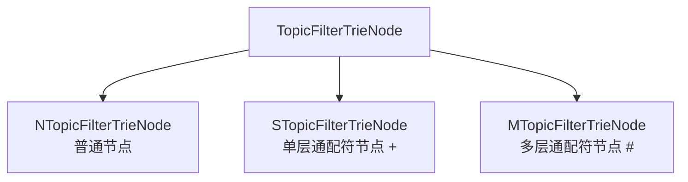
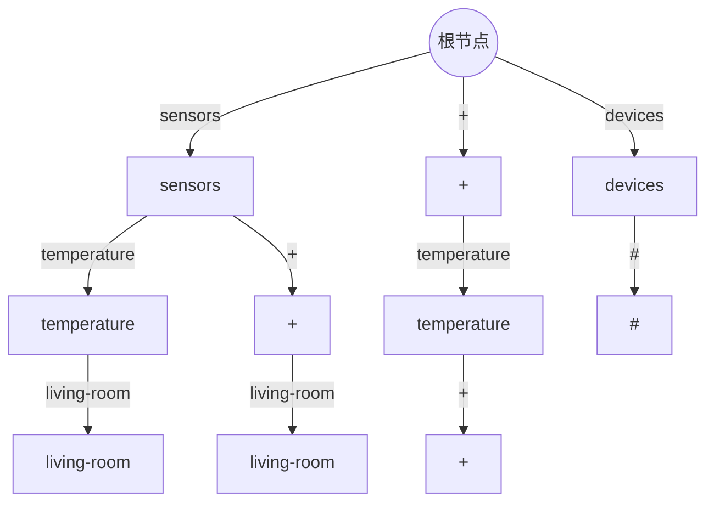

# Topic Filter (主题过滤器) 在 MQTT 主题匹配中的实现原理

在上篇文章我们详细探讨了前缀树（Trie）在 MQTT 主题匹配中的基础应用。本文将进一步深入，介绍代码中实现的 Topic Filter（主题过滤器）机制，它是 MQTT 主题匹配的核心组件。

## Topic Filter 的概念

在 MQTT 中，Topic Filter 是指订阅者用来表示希望接收哪些主题消息的模式。与具体的 Topic（主题）不同，Topic Filter 可以包含通配符：
- `+`：单层通配符，匹配任意一个主题层级
- `#`：多层通配符，匹配零个或多个主题层级（必须位于末尾）

## 代码中的 Topic Filter 结构

代码实现了一个高效的 Topic Filter 机制，主要包含以下组件：

### 1. TopicFilterTrieNode 抽象类

这是所有主题过滤器节点的基类，定义了以下关键方法：

```java
abstract class TopicFilterTrieNode<V> {
    abstract String levelName();                       // 获取节点的层级名称
    abstract Set<TopicTrieNode<V>> backingTopics();    // 获取匹配的主题节点
    abstract void seekChild(String childLevelName);    // 查找大于等于指定名称的子节点
    abstract void seekPrevChild(String childLevelName);// 查找小于等于指定名称的子节点
    abstract boolean atValidChild();                  // 检查当前是否指向有效子节点
    abstract TopicFilterTrieNode<V> childNode();      // 获取子节点
}
```

### 2. 三种具体实现类



#### NTopicFilterTrieNode (普通节点)

- 表示具体的主题层级名称
- 精确匹配主题层级
- 实现：
  ```java
  final class NTopicFilterTrieNode<V> extends TopicFilterTrieNode<V> {
      private final String levelName;
      private final Set<TopicTrieNode<V>> siblingTopicTrieNodes;
      // ...
  }
  ```

#### STopicFilterTrieNode (单层通配符节点)

- 表示 `+` 通配符
- 匹配当前层级的任意一个主题名
- 实现：
  ```java
  final class STopicFilterTrieNode<V> extends TopicFilterTrieNode<V> {
      private final Set<TopicTrieNode<V>> siblingTopicTrieNodes;
      // ...
      
      @Override
      String levelName() {
          return SINGLE_WILDCARD; // "+"
      }
  }
  ```

#### MTopicFilterTrieNode (多层通配符节点)

- 表示 `#` 通配符
- 匹配剩余的所有层级
- 实现：
  ```java
  final class MTopicFilterTrieNode<V> extends TopicFilterTrieNode<V> {
      private final Set<TopicTrieNode<V>> siblingTopicTrieNodes;
      
      @Override
      String levelName() {
          return MULTI_WILDCARD; // "#"
      }
      
      @Override
      Set<TopicTrieNode<V>> backingTopics() {
          // 递归收集所有匹配的主题
          // ...
      }
  }
  ```

### 3. TopicFilterIterator 迭代器

`TopicFilterIterator` 类提供了在主题树中高效查找匹配主题的机制：

```java
public class TopicFilterIterator<V> implements ITopicFilterIterator<V> {
    private final TopicTrieNode<V> topicTrieRoot;
    private final Stack<TopicFilterTrieNode<V>> traverseStack = new Stack<>();
    
    // 方法：seek、next、prev、key、value等
}
```

- 使用栈结构保存遍历路径
- 提供 `seek`、`next`、`prev` 等方法进行高效遍历
- 实现了有序遍历，可以找到具有相同前缀的所有主题

## 工作原理示例

### 情景：订阅匹配

假设我们有以下主题结构：
```
sensors/temperature/living-room
sensors/humidity/kitchen
devices/lights/bedroom
```

以及以下订阅（Topic Filters）：
```
sensors/+/living-room
devices/#
+/temperature/+
```

当需要查找匹配 `sensors/temperature/living-room` 的订阅时：



1. `TopicFilterIterator` 从根节点开始遍历
2. 对于 `sensors` 层级：
    - 匹配精确的 `sensors` 节点
    - 匹配根级的 `+` 节点
3. 对于 `temperature` 层级：
    - 在 `sensors` 下匹配精确的 `temperature`
    - 在 `sensors` 下匹配 `+` 节点
    - 在根级 `+` 下匹配精确的 `temperature`
4. 对于 `living-room` 层级：
    - 匹配所有路径下的 `living-room`
    - 匹配所有路径下的 `+` 节点
    - 检查路径上所有的 `#` 节点

最终找到匹配的订阅：`sensors/+/living-room` 和 `+/temperature/+`。

### 系统主题特殊处理

代码中对系统主题（以 `$` 开头）进行了特殊处理：

```java
boolean wildcardMatchable = level > 0 || !levelName.startsWith(SYS_PREFIX);
```

这确保了根级别（level=0）的系统主题不会被通配符匹配。例如，`$SYS/broker/stats` 不会被 `+/broker/stats` 或 `#` 匹配到。

## 性能优势

1. **空间效率**：共享前缀节点，减少存储开销
2. **时间效率**：O(m) 复杂度，其中 m 是主题层级数
3. **灵活查找**：支持前向、后向以及定位查找
4. **通配符处理**：高效处理 MQTT 的通配符匹配规则

## 实际应用示例

### 智能家居场景

在一个智能家居系统中，设备通过不同主题发布状态和接收命令：

```
home/livingroom/light/status  -> "on"
home/kitchen/temp/current     -> "23.5"
```

控制应用可以通过以下主题过滤器订阅：
- 所有灯光状态：`home/+/light/status`
- 所有温度传感器：`home/+/temp/+`
- 客厅所有设备：`home/livingroom/#`

当温度传感器发布更新时，Topic Filter 机制能够快速找到所有应该接收该消息的订阅者。

## 总结

MQTT 的 Topic Filter 机制是实现其灵活订阅模式的核心。通过前缀树和专用的过滤器节点结构，可以高效地处理包含通配符的主题匹配。代码中的实现不仅满足了 MQTT 规范要求，还通过精心设计的数据结构和算法提供了高性能的主题过滤功能。

这种实现方式使得 MQTT 代理能够在大量订阅和复杂的主题层次结构下，依然保持高效的消息路由和分发能力。